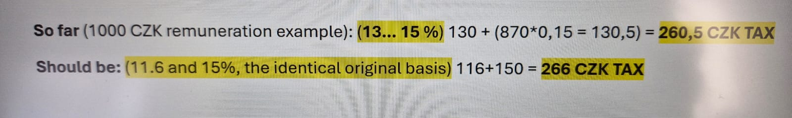

This code helps to calculate the reward money from FROV. 
The function account for:
- People from faculty (e.g., me)
- People outside the faculty (e.g., Fran)
- Tonda

Example of calculation from Tonda: 
 
